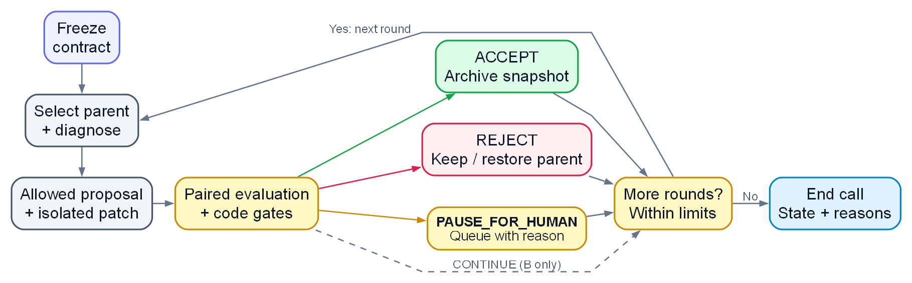

# self-evolve

Improve a skill or repository through proposed changes, evaluation in a Git worktree, and evidence-based acceptance.

[](https://docs.anthropic.com/en/docs/claude-code)
[](LICENSE)
[](README_CN.md)
[](ROADMAP.md)

[English](README.md) | [中文版](README_CN.md)

## ⭐ Design Philosophy

A self-improvement loop can raise its score by changing the task, dropping hard
cases, or grading its own output. Open-ended work makes that especially difficult
to detect because there may be no single ground truth. self-evolve therefore
starts with an observable improvement contract and keeps the comparison stable.

- **Evidence sources.** The loop is
  `profile → reflect → propose → patch → evaluate → accept or review`.
  A uses executed tests, B uses independently verified facts, and C needs supplied
  measurements. Missing measurements remain unavailable; changing a label cannot
  create evidence.
- **Fixed evaluation contract.** Freeze the policy, obligations and holdout before
  editing, and compare the parent and candidate by the same identities. This
  limits task removal and grader changes as routes to a higher
  score, at the cost of starting a new evaluation contract when the goal changes.
- **Proposal and acceptance responsibilities.** Models propose changes;
  deterministic gates handle evidence and acceptance. Retain actual provider
  metadata when judging independence; different
  requested aliases cannot establish it. A gate still depends on the quality of
  its inputs and the assumptions behind its statistics.
- **Recovery and auditability.** Failures, rejection, and review
  are useful outcomes. Preserve measured populations and exact candidate bytes,
  with the final documentation and source revision ready before review. This costs
  storage and review effort but makes a decision auditable and a rollback possible.
- **Data and authorization boundaries.** Real evidence stays in a verified
  PRIVATE Git companion. Worktrees isolate edits, but do not prove operating-system
  isolation. Accepted candidates are archived; publishing, merging, and sending
  follow the caller's authorization as separate actions.

The [full rationale and tradeoffs](PHILOSOPHY.md) explain these choices.
[Current limits](#current-limits) define what the shipped loop can execute.

## Implemented A/B loop

<p align="center">
  <a href="docs/diagrams/workflow-en.png"></a>
</p>

[Diagram source](docs/diagrams/workflow-en.dot) · [render script](docs/diagrams/render.py)

ACCEPT archives a candidate snapshot; merging requires its own authorization.
`CONTINUE` and queued review can start a fresh round, bounded by `--max-rounds`
and circuit breakers. Checks can reject before evaluation; unavailable required
evidence, insufficient review independence, or failed restoration can end the
invocation early. See [runtime and recovery](reference/runtime.md#resume-and-recovery).

## Install

Clone the repository with its pinned guard and style submodules:

```bash
git clone --recursive https://github.com/DaizeDong/self-evolve.git
```

The skill entry is [SKILL.md](SKILL.md); command adapters live in [commands/](commands/).
Use the absolute `tools/sie_cli.py` entrypoint from another directory or an
installation alias. Run `python -m pytest tests` for the business suite.

## Config

Set `SELF_EVOLVE_CONFIG` (alias `SELF_EVOLVE_CONFIG_DIR`) to an existing PRIVATE
Git companion, or `SELF_EVOLVE_DATA_DIR` to exactly its absolute `data/` path.
An inherited DATA_DIR takes precedence over CONFIG. The `data/` directory may be
absent; runtime writes require source-contract ownership and valid PRIVATE proof,
with no companion-root or public-worktree fallback.

[Runtime configuration](reference/runtime.md#configuration) defines discovery
order, visibility prerequisites, store switching, and source-only worktree layout.
[config.contract.json](config.contract.json) declares runtime-storage-only
configuration: per-run frozen profiles and the retention ledger are DATA, with no
separate settings registry. [DATA.md](DATA.md) and
[storage.contract.json](storage.contract.json) define retained outputs, reviewed
retirement, recovery and generated-storage admission limits. Keep final
deliverables and their unique cited evidence in the PRIVATE companion.

Model calls inherit installed `llmcall` routing, model, timeout, and fallback
settings. Agents use `mode="agent"`; text judges use default judge mode. Review
independence uses actual returned providers, as specified in
[model calls](reference/runtime.md#proposals-and-model-calls).

## Usage

From the repository, inspect prerequisites, initialize, then run:

```bash
python -m tools.sie.cli doctor --target <target>
python -m tools.sie.cli init --target <target>
python -m tools.sie.cli run --target <target> --run-id <id> --base-ref HEAD --max-rounds 3
python -m tools.sie.cli status --target <target> --run-id <id>
```

Read the doctor's JSON, including `private_data.available`; a zero exit status
alone does not prove readiness. The target needs Git history and usable evaluation
evidence. Default `builtin` proposals consume supplied fixes. Add `--live` for
model proposals and parallel reflection, or `--proposer llm-artifact` for JSON
artifact proposals. Resume by running the same run ID again.

[CLI and recovery](reference/runtime.md#cli) covers all options, replay, rollback,
and selfboot. [Evaluation](reference/evaluation.md) defines accepted evidence.

## Current limits

- A measures test outcomes. If no paired result changes, it requests human review.
- B compares frozen facts using independent verification; synthetic anchors only test mechanics.
- C can validate supplied evidence at the API level, but the loop has no regression
  or consistency measurement producer. Automatic scenario generation is unimplemented.
- Profiling can detect A+B; the loop refuses that combination before proposals.
- `--mode gated` does not provide per-step review. `--self` supports A evaluation.
- Worktrees, prompt filtering, and static checks do not establish an operating-system sandbox.
- Statistical guarantees require the assumptions in
  [acceptor math](reference/acceptor_math.md); there is no established run-wide error bound.

## Documentation

[Philosophy](PHILOSOPHY.md) · [Agent workflow](SKILL.md) · [Runtime](reference/runtime.md) ·
[Evaluation](reference/evaluation.md) · [Data](DATA.md) · [Roadmap](ROADMAP.md)

For changes to the tool or a target, record the affected documentation, finish it
before reviewing the candidate, and hand off the exact reviewed revision and
checks. See [documentation lifecycle](reference/maintenance.md).

## License

[MIT](LICENSE). Release history is in [CHANGELOG.md](CHANGELOG.md).
