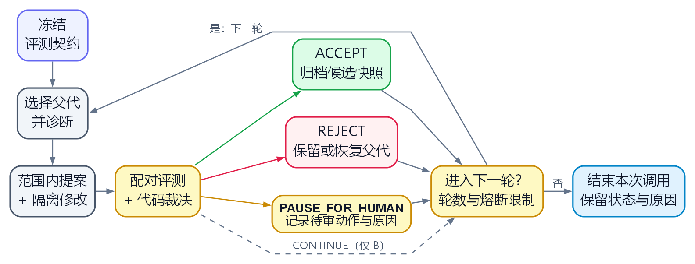

# self-evolve

对 skill 或仓库提出修改，在 Git worktree 中评测，再按证据决定是否采纳。

[](https://docs.anthropic.com/en/docs/claude-code)
[](LICENSE)
[](README.md)
[](ROADMAP.md)

[English](README.md) | [中文版](README_CN.md)

## ⭐ 设计哲学

自我改进的循环可能通过改题、删掉难例或给自己打分来提高分数。开放式任务往往没有
唯一真值，这些变化就更难发现。因此，self-evolve 先确定可观察的改进判据，再固定比较口径。

- **证据来源。** 流程为
  `profile → reflect → propose → patch → evaluate → accept or review`。
  A 使用实际执行的测试，B 使用独立核验的事实，C 需要调用方提供测量。
  没有取得的观测就报告不可用；改标签不能产生证据。
- **固定评测契约。** 修改前固定评测策略、比较义务和留出集，按同一组身份比较父代与候选。
  这样可以限制删题或改评分器带来的分数增长；代价是目标改变时，需要另建评测契约。
- **提案与采纳的职责。** 模型提出修改建议；确定性检查处理证据并决定是否采纳。
  判断评审独立性时保留实际 provider；请求时使用不同别名不能证明独立。
  检查结果仍取决于输入质量和统计假设。
- **恢复与审查。** 失败、拒绝和转交人审都有价值。
  保存实际测量对象与候选的完整内容，评审前完成文档并确定源码版本。
  这会增加存储和审查成本，但能让决策可核对、候选可回滚。
- **数据与授权边界。** 真实证据放在验证为 PRIVATE 的 Git 伴生仓。
  worktree 隔离修改，但不能证明操作系统权限隔离。采纳的候选会归档；
  发布、合并和对外发送作为独立动作，按调用方获得的授权处理。

[完整设计理由与取舍](PHILOSOPHY.md#中文)进一步说明这些选择。
[当前限制](#当前限制)界定已交付循环的执行范围。

## 已实现的 A/B 循环

<p align="center">
  <a href="docs/diagrams/workflow-cn.png"></a>
</p>

[绘图源码](docs/diagrams/workflow-cn.dot) · [渲染脚本](docs/diagrams/render.py)

ACCEPT 归档候选快照；合并仍须单独获得授权。
`CONTINUE` 和已入队的人审可进入新一轮，受 `--max-rounds` 与熔断条件限制。
检查可能在评测前拒绝当前轮；必需证据缺失、评审独立性不足或恢复失败，可能提前结束本次调用。
详见[运行与恢复](reference/runtime.md#resume-and-recovery)。

## 安装

克隆仓库时一并获取固定版本的 guard 和 style 子模块：

```bash
git clone --recursive https://github.com/DaizeDong/self-evolve.git
```

技能入口是 [SKILL.md](SKILL.md)，命令适配器位于 [commands/](commands/)。
从其他目录或安装别名启动时，使用 `tools/sie_cli.py` 的绝对路径。
业务测试运行 `python -m pytest tests`。

## 配置

将 `SELF_EVOLVE_CONFIG`（别名 `SELF_EVOLVE_CONFIG_DIR`）指向已有的 PRIVATE
Git 伴生仓，或将 `SELF_EVOLVE_DATA_DIR` 指向该仓准确的 `data/` 绝对路径。
继承的 DATA_DIR 优先于 CONFIG。`data/` 可以尚未创建；运行写入须先匹配源码存储契约，
并取得有效的 PRIVATE 证明，不会退回伴生仓根目录或公开工作树。

[运行配置](reference/runtime.md#configuration) 规定发现顺序、可见性前置条件、
存储切换和仅含源码的工作树布局。[config.contract.json](config.contract.json)
声明本工具只负责运行存储选择：每次运行的冻结 profile 和保留登记表属于 DATA，
没有另一套设置注册表。[DATA.md](DATA.md) 与
[storage.contract.json](storage.contract.json) 规定产物保留、经审查的清理、恢复和
生成存储准入限制。最终交付物及其引用的唯一证据保存在 PRIVATE 伴生仓。

模型调用继承已安装 `llmcall` 的路由、模型、超时和回退设置。
agent 使用 `mode="agent"`，文本 judge 使用默认模式。评审独立性依据实际返回的
provider，具体要求见[模型调用](reference/runtime.md#proposals-and-model-calls)。

## 使用

从仓库目录检查前置条件、初始化，再运行：

```bash
python -m tools.sie.cli doctor --target <target>
python -m tools.sie.cli init --target <target>
python -m tools.sie.cli run --target <target> --run-id <id> --base-ref HEAD --max-rounds 3
python -m tools.sie.cli status --target <target> --run-id <id>
```

阅读 doctor 的 JSON，包括 `private_data.available`；退出码为零不能单独证明就绪。
目标需要 Git 历史和可用评测证据。默认 `builtin` 使用已提供的修复内容生成提案。
添加 `--live` 可启用模型提案和并行反思；JSON 产物提案使用
`--proposer llm-artifact`。以同一 run ID 再次运行即可续跑。

完整参数、replay、rollback 和自举见 [CLI 与恢复](reference/runtime.md#cli)，
评测证据要求见 [Evaluation](reference/evaluation.md)。

## 当前限制

- A 衡量测试结果；所有配对结果都没有变化时，转交人审。
- B 独立核验冻结事实；合成锚只能验证机制。
- C 的 API 可以校验调用方提供的证据，但主循环没有回归或一致性测量生产者。
  自动场景生成尚未实现。
- PROFILE 可以识别 A+B，但主循环会在提案前拒绝执行该组合。
- `--mode gated` 不提供逐步人审。`--self` 支持 A 路评测。
- worktree、prompt 过滤和静态检查不能证明操作系统沙箱隔离。
- 统计保证依赖 [acceptor 数学说明](reference/acceptor_math.md) 中的假设；
  当前没有整次运行的错误概率上界证明。

## 文档

[设计哲学](PHILOSOPHY.md#中文) · [Agent 工作流](SKILL.md) · [运行说明](reference/runtime.md) ·
[评测契约](reference/evaluation.md) · [数据](DATA.md) · [路线图](ROADMAP.md)

修改工具或目标时，记录哪些文档受影响，在候选评审前完成更新，交付评审所用的准确版本和检查结果。
详见[文档维护流程](reference/maintenance.md)。

## 许可

[MIT](LICENSE)。版本记录见 [CHANGELOG.md](CHANGELOG.md)。
